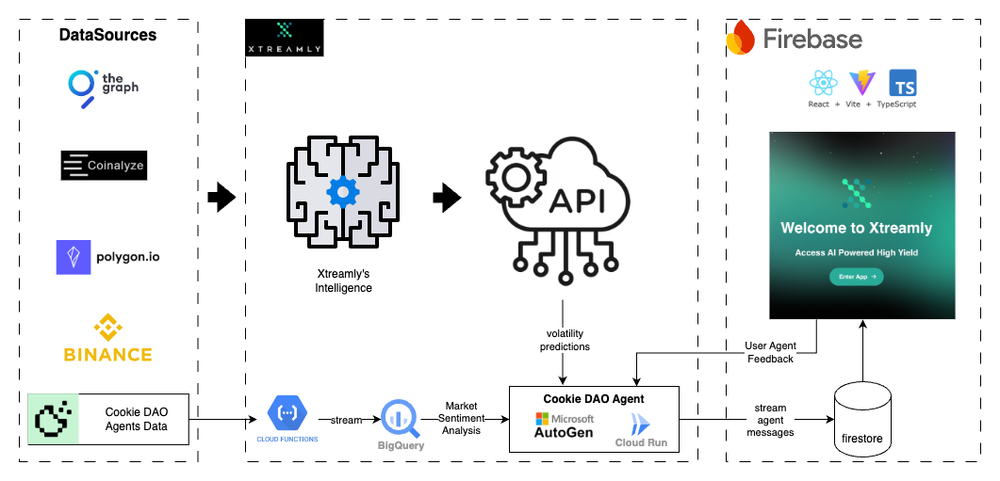

# Xtreamly Agent

Welcome to the Xtreamly AI Agent.
The first super intelligent automated trading DeFi Agent.

This agent leverages Xtreamly's unique volatility predictions and Cookie DAO's market sentiment analysis to perform high yielding trading strategies.

Read more about how our agents operate here: [Agent Policy](cookiedao%2Fpolicy.md)

## Architecture



# Prerequisites

1. Nvm installed on the machine, or Node version v20.18.0 (inside the .nvmrc file)
2. Python 3.10.14

## Local setup

## 🛠 Installation

1. Clone this repository:

   ```bash
   git clone https://github.com/Xtreamly-Team/xtreamly-agent.git
   ```

   ```bash
   cd xtreamly-agent
   ```

2. Install the required python dependencies:

   ```bash
   pip install -r requirements.txt
   ```

3. Install the required node dependencies:

   ```bash
   nvm use
   ```
   ```bash
   npm install -g yarn
   ```
   ```bash
   yarn
   ```

4. Optional: Configure environment variables in a `.env` file (if needed for additional customizations).

## 🚀 Run Locally

1. Start the backend agent server:

   ```bash
   python main.py
   ```

   By default, the server runs on port `8000`. This can be customized using the `PORT` environment variable.

   Visit API: http://localhost:8000


2. Start the frontend (on another tab):
   ```bash
   yarn start
   ```
   Visit ui: http://localhost:5173/

## ⚙️ Configuration

- **CORS Middleware:** Configured to allow specific origins (e.g., `localhost` on common development ports).
- **Environment Variables:** You need to set the `.env` variables to run data fetching:
  - OPENAI_API_KEY
  - FIRECRAWL_API_KEY
  - COOKIE_DAO_API
  - Firebase service account creds file: `./xtreamly-firebase.json`

## 💻 Build Docker Image

   ```bash
   docker build -t fastapi .
   ```

Your Anaconda environment is now set up, and you can proceed to run or develop the application.

## Knowledge

- https://www.youtube.com/watch?v=dW-qr_ntOgc&t=173s
- https://fastapi.tiangolo.com/advanced/websockets/
